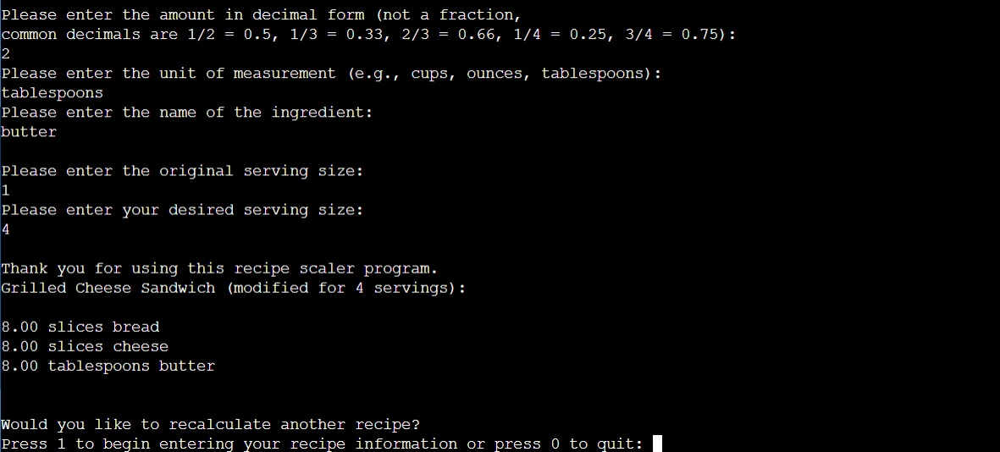

# 📂 Java Recipe Scaler
Recipe Scaler - Capstone project for Java (CSC 1060-502)

**Description**: A Java console application that scales recipes up or down based on user input. Users enter the original recipe and serving size, then specify the desired servings. The program calculates and outputs the adjusted ingredient amounts.

**Tech Stack**: Java
* Arrays for storing ingredients
* Loops and control statements for calculations
* Console-based user interface

**Features**
* Accepts user input for ingredients, measurements, and serving size
* Calculates new ingredient amounts based on desired servings
* Outputs the adjusted recipe to the console
* Menu-driven interface with input validation

**How to Run**
```
bash
javac RecipeScaler.java
java RecipeScaler
```

**Sample Usage**


**Possible Future Improvements**
* Add file I/O for saving and loading recipes
* Extend to support unit conversions (e.g., cups to tablespoons)
* Expand input validation for different ingredient formats
